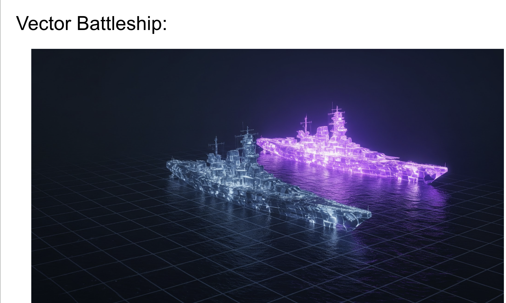

# roach-battleship
This repo is a reworking and expansion on the otVectorBattleship repo.  This version uses CockroachDB as the vectorDB


## Python-preparation Steps for running the program on your machine:


1. Create a virtual environment:

```
python3 -m venv rbenv
```

2. Activate it:  [This step is repeated anytime you want this venv back]

```
source rbenv/bin/activate
```

On windows you would do:

```
rbenv\Scripts\activate
```
If no permission in Windows
 The Fix (Temporary, Safe, Local):
In PowerShell as Administrator, run:
```

Set-ExecutionPolicy -Scope CurrentUser -ExecutionPolicy RemoteSigned
```
Then confirm with Y when prompted.


## Python will utilize this requirements.txt in the project:

```
psycopg[binary]

```

3. Install the libraries: [only necesary to do this one time per environment]

```
pip3 install -r requirements.txt
```


## install and Initialize a cockroach database to act as a vectorDB:


** download cockroachdb binary (you can use a single instance for testing) 

for mac you do:
```
brew install cockroachdb/tap/cockroach
```

You can then check for location/existence of cockroachDB:
```
which cockroach
```

<em> See full instructions here:  https://www.cockroachlabs.com/docs/v25.2/install-cockroachdb-mac.html 

(There are options there for Linux and Windows as well)
</em>

## You can start a single node instance of cockroachDB in the following way:

to keep things as simple as possible, start an instance requiring no TLS (Transport Layer Security):

```
cockroach start-single-node --insecure --accept-sql-without-tls --background
```

<em>See full instructions here:  https://www.cockroachlabs.com/docs/stable/cockroach-start-single-node  </em>

By default:

This local instance of cockroachDB will run listening on port 26257 (for SQL and commandline connections)

This local instance will also listen on port 8080 with its web-browser-serving dbconsole UI 

## From a separate shell you can connect to this instance, create a database and the tables needed to begin:

to execute all the SQL commands needed plus some test queries from the root of this project do:
```
cockroach sql --insecure -f crdb_setup.sql
```

If you wish to execute other sql -- The following command connects using the provided SQL CLI:

```
cockroach sql --insecure
```

A sample query you may wish to run:

```
select pk, anchorpoint, battleship_class, quadrant from battleship order by quadrant asc;
```
## Run the populate_quadrants.py program to write a bunch of battlships into the database:

```
python3 populate_quadrants.py <number_of_ships_to_create>
```

example:

```
python3 populate_quadrants.py 15
```


## Run the human_player.py program to try your hand at seeking battlehips


```
python3 human_player.py <percentage_watermark_filter> <number_of_tries>
```

example:

```
python3 human_player.py 45 10
```

## Run a battle bot that repeatedly generates ship vectors and then tests for their overlap in the vector space (it gets 100 tries):

```
python3 battle_bot.py <match_percentage_threshold>
```

Example:

```
python3 battle_bot.py 70
```

## NB: the battle_bot runs until it hits a ship with an exact match on type, location, and quadrant
## It will use the match_percentage_threshold as a guide to hone in on ship_type and quadrant which should speed up finding exact matches  (the lower the threshold, the more sticky the attampts will be to the same quadrant and ship_type)

example:
```
Attempting to place a 'skiff' in quadrant 2 at anchor (3, 3)
 Target generated skiff has anchor_point of 23
| ~  ~  ~  ~  ~  ~  ~  ~  ~  ~  |
| ~  ~  ~  ~  ~  ~  ~  ~  ~  ~  |
| ~  ~ | | ~  ~  ~  ~  ~  ~  ~  |
| ~  ~ | | ~  ~  ~  ~  ~  ~  ~  |
| ~  ~ | | ~  ~  ~  ~  ~  ~  ~  |
| ~  ~ | | ~  ~  ~  ~  ~  ~  ~  |
| ~  ~  ~  ~  ~  ~  ~  ~  ~  ~  |
| ~  ~  ~  ~  ~  ~  ~  ~  ~  ~  |
| ~  ~  ~  ~  ~  ~  ~  ~  ~  ~  |
| ~  ~  ~  ~  ~  ~  ~  ~  ~  ~  |


[0.0, 0.0, 0.0, 0.0, 0.0, 0.0, 0.0, 0.0, 0.0, 0.0, 0.0, 0.0, 0.0, 0.0, 0.0, 0.0, 0.0, 0.0, 0.0, 0.0, 0.0, 0.0, 4.331, 0.0, 0.0, 0.0, 0.0, 0.0, 0.0, 0.0, 0.0, 0.0, 4.331, 0.0, 0.0, 0.0, 0.0, 0.0, 0.0, 0.0, 0.0, 0.0, 4.331, 0.0, 0.0, 0.0, 0.0, 0.0, 0.0, 0.0, 0.0, 0.0, 4.331, 0.0, 0.0, 0.0, 0.0, 0.0, 0.0, 0.0, 0.0, 0.0, 0.0, 0.0, 0.0, 0.0, 0.0, 0.0, 0.0, 0.0, 0.0, 0.0, 0.0, 0.0, 0.0, 0.0, 0.0, 0.0, 0.0, 0.0, 0.0, 0.0, 0.0, 0.0, 0.0, 0.0, 0.0, 0.0, 0.0, 0.0, 0.0, 0.0, 0.0, 0.0, 0.0, 0.0, 0.0, 0.0, 0.0, 0.0]
No ships detected in quadrant.

Attempting to place a 'submarine' in quadrant 1 at anchor (3, 4)
 Target generated submarine has anchor_point of 33
| ~  ~  ~  ~  ~  ~  ~  ~  ~  ~  |
| ~  ~  ~  ~  ~  ~  ~  ~  ~  ~  |
| ~  ~  ~  ~  ~  ~  ~  ~  ~  ~  |
| ~  ~  .  ~  ~  ~  ~  ~  ~  ~  |
| ~  ~  .  ~  ~  ~  ~  ~  ~  ~  |
| ~  ~  .  ~  ~  ~  ~  ~  ~  ~  |
| ~  ~  .  ~  ~  ~  ~  ~  ~  ~  |
| ~  ~  .  ~  ~  ~  ~  ~  ~  ~  |
| ~  ~  .  ~  ~  ~  ~  ~  ~  ~  |
| ~  ~  ~  ~  ~  ~  ~  ~  ~  ~  |


[0.0, 0.0, 0.0, 0.0, 0.0, 0.0, 0.0, 0.0, 0.0, 0.0, 0.0, 0.0, 0.0, 0.0, 0.0, 0.0, 0.0, 0.0, 0.0, 0.0, 0.0, 0.0, 0.0, 0.0, 0.0, 0.0, 0.0, 0.0, 0.0, 0.0, 0.0, 0.0, 0.1715, 0.0, 0.0, 0.0, 0.0, 0.0, 0.0, 0.0, 0.0, 0.0, 0.1715, 0.0, 0.0, 0.0, 0.0, 0.0, 0.0, 0.0, 0.0, 0.0, 0.1715, 0.0, 0.0, 0.0, 0.0, 0.0, 0.0, 0.0, 0.0, 0.0, 0.1715, 0.0, 0.0, 0.0, 0.0, 0.0, 0.0, 0.0, 0.0, 0.0, 0.1715, 0.0, 0.0, 0.0, 0.0, 0.0, 0.0, 0.0, 0.0, 0.0, 0.1715, 0.0, 0.0, 0.0, 0.0, 0.0, 0.0, 0.0, 0.0, 0.0, 0.0, 0.0, 0.0, 0.0, 0.0, 0.0, 0.0, 0.0]

At least one ship detected in quadrant:
  - Detected_Ship_Class: submarine, Match_Percentage: 80.48%, Hidden_Anchor_Point: 43

📡 Honing in on quadrant 1 with suspect_ship_type submarine and suspect_ship_reuse_count 0
  - Detected_Ship_Class: submarine, Match_Percentage: 62.73%, Hidden_Anchor_Point: 27

📡 Honing in on quadrant 1 with suspect_ship_type submarine and suspect_ship_reuse_count 1

...<a few tries later>...

📡 Honing in on quadrant 1 with suspect_ship_type submarine and suspect_ship_reuse_count 6
  - Detected_Ship_Class: submarine, Match_Percentage: 62.73%, Hidden_Anchor_Point: 43

📡 Honing in on quadrant 1 with suspect_ship_type submarine and suspect_ship_reuse_count 7

Attempting to place a 'submarine' in quadrant 1 at anchor (7, 3)
 Target generated submarine has anchor_point of 27
| ~  ~  ~  ~  ~  ~  ~  ~  ~  ~  |
| ~  ~  ~  ~  ~  ~  ~  ~  ~  ~  |
| ~  ~  ~  ~  ~  ~  .  ~  ~  ~  |
| ~  ~  ~  ~  ~  ~  .  ~  ~  ~  |
| ~  ~  ~  ~  ~  ~  .  ~  ~  ~  |
| ~  ~  ~  ~  ~  ~  .  ~  ~  ~  |
| ~  ~  ~  ~  ~  ~  .  ~  ~  ~  |
| ~  ~  ~  ~  ~  ~  .  ~  ~  ~  |
| ~  ~  ~  ~  ~  ~  ~  ~  ~  ~  |
| ~  ~  ~  ~  ~  ~  ~  ~  ~  ~  |


[0.0, 0.0, 0.0, 0.0, 0.0, 0.0, 0.0, 0.0, 0.0, 0.0, 0.0, 0.0, 0.0, 0.0, 0.0, 0.0, 0.0, 0.0, 0.0, 0.0, 0.0, 0.0, 0.0, 0.0, 0.0, 0.0, 0.1715, 0.0, 0.0, 0.0, 0.0, 0.0, 0.0, 0.0, 0.0, 0.0, 0.1715, 0.0, 0.0, 0.0, 0.0, 0.0, 0.0, 0.0, 0.0, 0.0, 0.1715, 0.0, 0.0, 0.0, 0.0, 0.0, 0.0, 0.0, 0.0, 0.0, 0.1715, 0.0, 0.0, 0.0, 0.0, 0.0, 0.0, 0.0, 0.0, 0.0, 0.1715, 0.0, 0.0, 0.0, 0.0, 0.0, 0.0, 0.0, 0.0, 0.0, 0.1715, 0.0, 0.0, 0.0, 0.0, 0.0, 0.0, 0.0, 0.0, 0.0, 0.0, 0.0, 0.0, 0.0, 0.0, 0.0, 0.0, 0.0, 0.0, 0.0, 0.0, 0.0, 0.0, 0.0]

At least one ship detected in quadrant:
  - Detected_Ship_Class: submarine, Match_Percentage: 100.0%, Hidden_Anchor_Point: 27


        <****> AFTER 14 ATTEMPTS <****> 

                PERFECT HIT -- EXITING PROGRAM

%^%^%^%^***. KABLOOEY!!!!! 

deleting row with PK == b5a81641-4af0-4119-bded-6c9e183d6548
```

## to view the activity in the database you can open the dbconsole in a browser:
```
https://localhost:8080
````


### random vector details: (look for these PGVector commands to be added to CRDB (late 2025))
-- NB there are options in terms of the search algorithm chosen:

-- L2 (Euclidean)  [default]
SELECT ... ORDER BY vector <-> '[query_vector]' LIMIT 5

-- Cosine
SELECT ... ORDER BY vector <=> '[query_vector]' LIMIT 5

-- Inner Product
SELECT ... ORDER BY vector <#> '[query_vector]' LIMIT 5
