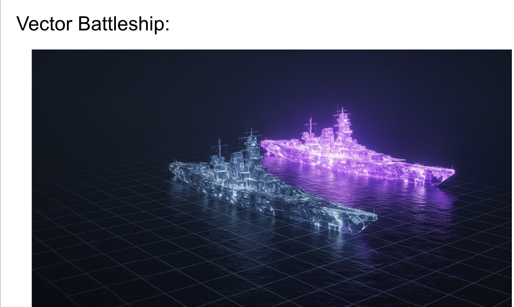

# roach-battleship
This repo is a demo of using Euclidean distance with Vector Search to identify similar objects within a shared vector space.  This version uses CockroachDB as the vectorDB. The goal is to provide a bit of fun and clarify how vectors can be constructed to enable utility when seeking to determine object similarity.  (it is, of course possible to adjust the query criteria to isolate anomalies - something you might do for fraud detection or when you seek outliers).  

It could be an interesting challenge for the curious to enhance the battle_bot logic to make it smarter.  Have fun!

[Skip to Web-ui Section](#web-ui)

## NB: The default vectorization uses 105 elements/dimensions, there are optional additional table and strategies for the vector embeddings that reduces their size from 105 to 11, or 21 dimensions.  These embedding models are very different in their behavior which can illustrate the importance of good training and careful selection of the optimal model for a particular task.  

### Setup and Run

1. Ensure your local python environment is ready and your CockroachDB instance is installed and running and the database schema has been initialized (details below)

## Python-preparation Steps for running the program on your machine:


- **A: Create a virtual environment:**

```
python3 -m venv rbenv
```

- **B. Activate it:  [This step is repeated anytime you want this venv back]**

```
source rbenv/bin/activate
```

On windows you would do:

```
rbenv\Scripts\activate
```
If no permission in Windows
 The Fix (Temporary, Safe, Local):
In PowerShell as Administrator, run:
```

Set-ExecutionPolicy -Scope CurrentUser -ExecutionPolicy RemoteSigned
```
Then confirm with Y when prompted.

## Python will utilize this requirements.txt in the project:

```
psycopg[binary]

```

- **C. Install the libraries: [only necesary to do this one time per environment]**

```
pip3 install -r requirements.txt
```


## install and Initialize a cockroach database to act as a vectorDB:


- **download cockroachdb binary (you can use a single instance for testing)** 

for mac you do:
```
brew install cockroachdb/tap/cockroach
```

You can then check for location/existence of cockroachDB:
```
which cockroach
```

<em> See full instructions here:  https://www.cockroachlabs.com/docs/v25.2/install-cockroachdb-mac.html 

(There are options there for Linux and Windows as well)
</em>

### You can start a single node instance of cockroachDB in the following way:

to keep things as simple as possible, start an instance requiring no TLS (Transport Layer Security):

```
cockroach start-single-node --insecure --accept-sql-without-tls --background
```

<em>See full instructions here:  https://www.cockroachlabs.com/docs/stable/cockroach-start-single-node  </em>

By default:

This local instance of cockroachDB will run listening on port 26257 (for SQL and commandline connections)

This local instance will also listen on port 8080 with its web-browser-serving dbconsole UI 

## DB SETUP!

### From a separate shell you can connect to this instance, create a database and the tables needed to begin:

to execute all the SQL commands needed plus some test queries from the root of this project do:
```
cockroach sql --insecure -f crdb_setup.sql
```

## CLI Interactions:

When running populate_quadrants.py, batle_bot.py or human_player.py CLI versions of the app, enable specific vector dimensions by setting the following env variable: (choices are default (105), battle_v11 (11), and battle_v21 (21))

 
### when battle_v21 is selected, a 21 dimension vector is used to represent the ships (this one is the 'Goldilocks' option)

```
export BATTLESHIP_TABLE=vb.battle_v21
```

### when battle_v11 is selected, an 11 dimension vector is used to represent the ships. (this is less accurate) 

```
export BATTLESHIP_TABLE=vb.battle_v11
```

### 105 dimensions was the original attempt by this author and is less efficient and no more accurate than v21:

```
export BATTLESHIP_TABLE=vb.battleship
```


2. Make sure you have ships in the database (use populate_quadrants.py ) NB: Be sure to set the vector type based on the table you intend to use:

```
export BATTLESHIP_TABLE=vb.battle_v21
```

- **Run the populate_quadrants.py program to write a bunch of battleships into the database:**

```
python3 populate_quadrants.py <number_of_ships_to_create> <number_of_quadrants>
```

example with small dataset:

```
python3 populate_quadrants.py 15 4
```

example with large dataset:

```
python3 populate_quadrants.py 15000 3000
```

- **Run a battle bot that repeatedly generates ship vectors and then tests for their overlap in the vector space (it gets 100 tries):**
```
You need at least the first arg of the following ordered args: <percentage> <max_attempts> <sleep_time> <should_switch>
Example: python3 battle_bot.py 85 200
Example: python3 battle_bot.py 65 1000 0 False
```

```
python3 battle_bot.py <percentage> <max_attempts> <sleep_time> <should_switch>
```

Example uses default of 200 millis sleep when ship detected:

```
python3 battle_bot.py 70
```

Example user-specified sleep time of 10 millis when ship detected:

```
python3 battle_bot.py 70 100 10
```

## NB: the battle_bot runs until it runs out of attempts or hits a ship with an exact match on type, location, and quadrant
## It will use the match_percentage_threshold as a guide to hone in on ship_type and quadrant which should speed up finding exact matches  (the lower the threshold, the more sticky the attampts will be to the same quadrant and ship_type)


## Web-Based UI: Play Vector Battleship in your browser
<a id="web-ui"></a>


A single-file web interface using the Bottle framework provides visual feedback with color-coded heat maps showing how close you are to finding ships.

To play with a web-UI: Start the web server from the project root directory:

```
python3 bottle_web_ui.py
```

The server will start on http://localhost:8000

- **Open your browser and navigate to:**

```
http://localhost:8000
```

### How to Play

- **Select Vector Dimensions**: Choose which Vector Table to target (dropdown at top of grid)
- **Click 'Start Game'**: Each Game is specific to a type of vector and the table holding those ships
- **Select Quadrant**: Choose which quadrant to target (dropdown at top of grid)
- **Choose Ship Type**: Select submarine, destroyer, skiff, or aircraft carrier
- **Select Coordinates**: Click on the grid or use the X/Y sliders to pick coordinates
- **Fire Torpedo**: Click the "FIRE TORPEDO!" button to attempt targeting
- **View Results**:
  - Match percentage shows how close you are (higher = closer)
  - Color coding: Blue (cold) → Purple (cool) → Pink (warm) → Red (hot) → Gold (direct hit!)
  - Trend indicators show if you're getting warmer (↑) or cooler (↓)
  - Previous attempts appear on the grid with colored markers

Win by achieving a 100% match within 20 attempts!

### Single-File Design

The entire web UI (HTML, CSS, JavaScript, and backend logic) is contained in a single Python file (`bottle-ui.py`) for simplicity and portability. No separate static files or multiple modules needed!


### Additional info / options

If you wish to execute other sql -- The following command connects using the provided SQL CLI:

```
cockroach sql --insecure
```


If you wish to run in secure mode - check the CockroachLabs documentation to learn how to start the database in secure mode.  To run the battleship programs against a secure cockroachdb make sure you edit the sections of code that specify the location of the CERTDIR and in your working shell export SECURE_CRDB=true

```
export SECURE_CRDB=true
```

## if running the sql client that comes with CRDB in secure mode you would need to be certain to have the necessary certificates stored in a reachable folder and include them in your startup command for the client like this:

```
cockroach sql --certs-dir=/Users/owentaylor/.cockroach-certs --host=localhost --port=26257
```

A sample query you may wish to run:

```
select pk, anchorpoint, battleship_class, quadrant from battleship order by quadrant asc;
```

## Run the human_player.py program to try your hand at seeking battleships 
## note you will not be told how many possible quadrants exist - you will have to query the DB using:
## SELECT max(quadrant) AS "max_quadrant" from vb.battle_v21; 


```
python3 human_player.py <percentage_watermark_filter> <number_of_tries>
```

example:

```
python3 human_player.py 45 10
```


example:
```
Attempting to place a 'skiff' in quadrant 2 at anchor (3, 3)
 Target generated skiff has anchor_point of 23
| ~  ~  ~  ~  ~  ~  ~  ~  ~  ~  |
| ~  ~  ~  ~  ~  ~  ~  ~  ~  ~  |
| ~  ~ | | ~  ~  ~  ~  ~  ~  ~  |
| ~  ~ | | ~  ~  ~  ~  ~  ~  ~  |
| ~  ~ | | ~  ~  ~  ~  ~  ~  ~  |
| ~  ~ | | ~  ~  ~  ~  ~  ~  ~  |
| ~  ~  ~  ~  ~  ~  ~  ~  ~  ~  |
| ~  ~  ~  ~  ~  ~  ~  ~  ~  ~  |
| ~  ~  ~  ~  ~  ~  ~  ~  ~  ~  |
| ~  ~  ~  ~  ~  ~  ~  ~  ~  ~  |


[0.0, 0.0, 0.0, 0.0, 0.0, 0.0, 0.0, 0.0, 0.0, 0.0, 0.0, 0.0, 0.0, 0.0, 0.0, 0.0, 0.0, 0.0, 0.0, 0.0, 0.0, 0.0, 4.331, 0.0, 0.0, 0.0, 0.0, 0.0, 0.0, 0.0, 0.0, 0.0, 4.331, 0.0, 0.0, 0.0, 0.0, 0.0, 0.0, 0.0, 0.0, 0.0, 4.331, 0.0, 0.0, 0.0, 0.0, 0.0, 0.0, 0.0, 0.0, 0.0, 4.331, 0.0, 0.0, 0.0, 0.0, 0.0, 0.0, 0.0, 0.0, 0.0, 0.0, 0.0, 0.0, 0.0, 0.0, 0.0, 0.0, 0.0, 0.0, 0.0, 0.0, 0.0, 0.0, 0.0, 0.0, 0.0, 0.0, 0.0, 0.0, 0.0, 0.0, 0.0, 0.0, 0.0, 0.0, 0.0, 0.0, 0.0, 0.0, 0.0, 0.0, 0.0, 0.0, 0.0, 0.0, 0.0, 0.0, 0.0]
No ships detected in quadrant.

Attempting to place a 'submarine' in quadrant 1 at anchor (3, 4)
 Target generated submarine has anchor_point of 33
| ~  ~  ~  ~  ~  ~  ~  ~  ~  ~  |
| ~  ~  ~  ~  ~  ~  ~  ~  ~  ~  |
| ~  ~  ~  ~  ~  ~  ~  ~  ~  ~  |
| ~  ~  .  ~  ~  ~  ~  ~  ~  ~  |
| ~  ~  .  ~  ~  ~  ~  ~  ~  ~  |
| ~  ~  .  ~  ~  ~  ~  ~  ~  ~  |
| ~  ~  .  ~  ~  ~  ~  ~  ~  ~  |
| ~  ~  .  ~  ~  ~  ~  ~  ~  ~  |
| ~  ~  .  ~  ~  ~  ~  ~  ~  ~  |
| ~  ~  ~  ~  ~  ~  ~  ~  ~  ~  |


[0.0, 0.0, 0.0, 0.0, 0.0, 0.0, 0.0, 0.0, 0.0, 0.0, 0.0, 0.0, 0.0, 0.0, 0.0, 0.0, 0.0, 0.0, 0.0, 0.0, 0.0, 0.0, 0.0, 0.0, 0.0, 0.0, 0.0, 0.0, 0.0, 0.0, 0.0, 0.0, 0.1715, 0.0, 0.0, 0.0, 0.0, 0.0, 0.0, 0.0, 0.0, 0.0, 0.1715, 0.0, 0.0, 0.0, 0.0, 0.0, 0.0, 0.0, 0.0, 0.0, 0.1715, 0.0, 0.0, 0.0, 0.0, 0.0, 0.0, 0.0, 0.0, 0.0, 0.1715, 0.0, 0.0, 0.0, 0.0, 0.0, 0.0, 0.0, 0.0, 0.0, 0.1715, 0.0, 0.0, 0.0, 0.0, 0.0, 0.0, 0.0, 0.0, 0.0, 0.1715, 0.0, 0.0, 0.0, 0.0, 0.0, 0.0, 0.0, 0.0, 0.0, 0.0, 0.0, 0.0, 0.0, 0.0, 0.0, 0.0, 0.0]

At least one ship detected in quadrant:
  - Detected_Ship_Class: submarine, Match_Percentage: 80.48%, Hidden_Anchor_Point: 43

📡 Honing in on quadrant 1 with suspect_ship_type submarine and suspect_ship_reuse_count 0
  - Detected_Ship_Class: submarine, Match_Percentage: 62.73%, Hidden_Anchor_Point: 27

📡 Honing in on quadrant 1 with suspect_ship_type submarine and suspect_ship_reuse_count 1

...<a few tries later>...

📡 Honing in on quadrant 1 with suspect_ship_type submarine and suspect_ship_reuse_count 6
  - Detected_Ship_Class: submarine, Match_Percentage: 62.73%, Hidden_Anchor_Point: 43

📡 Honing in on quadrant 1 with suspect_ship_type submarine and suspect_ship_reuse_count 7

Attempting to place a 'submarine' in quadrant 1 at anchor (7, 3)
 Target generated submarine has anchor_point of 27
| ~  ~  ~  ~  ~  ~  ~  ~  ~  ~  |
| ~  ~  ~  ~  ~  ~  ~  ~  ~  ~  |
| ~  ~  ~  ~  ~  ~  .  ~  ~  ~  |
| ~  ~  ~  ~  ~  ~  .  ~  ~  ~  |
| ~  ~  ~  ~  ~  ~  .  ~  ~  ~  |
| ~  ~  ~  ~  ~  ~  .  ~  ~  ~  |
| ~  ~  ~  ~  ~  ~  .  ~  ~  ~  |
| ~  ~  ~  ~  ~  ~  .  ~  ~  ~  |
| ~  ~  ~  ~  ~  ~  ~  ~  ~  ~  |
| ~  ~  ~  ~  ~  ~  ~  ~  ~  ~  |


[0.0, 0.0, 0.0, 0.0, 0.0, 0.0, 0.0, 0.0, 0.0, 0.0, 0.0, 0.0, 0.0, 0.0, 0.0, 0.0, 0.0, 0.0, 0.0, 0.0, 0.0, 0.0, 0.0, 0.0, 0.0, 0.0, 0.1715, 0.0, 0.0, 0.0, 0.0, 0.0, 0.0, 0.0, 0.0, 0.0, 0.1715, 0.0, 0.0, 0.0, 0.0, 0.0, 0.0, 0.0, 0.0, 0.0, 0.1715, 0.0, 0.0, 0.0, 0.0, 0.0, 0.0, 0.0, 0.0, 0.0, 0.1715, 0.0, 0.0, 0.0, 0.0, 0.0, 0.0, 0.0, 0.0, 0.0, 0.1715, 0.0, 0.0, 0.0, 0.0, 0.0, 0.0, 0.0, 0.0, 0.0, 0.1715, 0.0, 0.0, 0.0, 0.0, 0.0, 0.0, 0.0, 0.0, 0.0, 0.0, 0.0, 0.0, 0.0, 0.0, 0.0, 0.0, 0.0, 0.0, 0.0, 0.0, 0.0, 0.0, 0.0]

At least one ship detected in quadrant:
  - Detected_Ship_Class: submarine, Match_Percentage: 100.0%, Hidden_Anchor_Point: 27


        <****> AFTER 14 ATTEMPTS <****> 

                PERFECT HIT -- EXITING PROGRAM

%^%^%^%^***. KABLOOEY!!!!! 

deleting row with PK == b5a81641-4af0-4119-bded-6c9e183d6548
```

## to view the activity in the database you can open the dbconsole in a browser:
```
https://localhost:8080
````


### CRDB vector details:  PGVector commands and augmentations continuing in 2026
https://www.cockroachlabs.com/docs/v26.2/vector-indexes.html

When creating the index for searching vectors, specify the intended comparison strategy 
(see crdb_setup.sql)

vector_cosine_ops, vector_l2_ops, or vector_ip_ops (for inner product)

-- NB there are options in terms of the search algorithm chosen:

### Available with CRDB version 25.2 2025: 

 -- L2 (Euclidean)  [default]
SELECT ... ORDER BY vector <-> '[query_vector]' LIMIT 5

### Available with CRDB version 25.3 2025: 
Measures the angle between two vectors, normalized for magnitude. Purely direction-based; magnitude has no effect.

-- Cosine
SELECT ... ORDER BY vector <=> '[query_vector]' LIMIT 5

### Available with CRDB version 25.3 2025: 
Sensitive to both the direction and the magnitude (length) of vectors.

-- Inner Product
SELECT ... ORDER BY vector <#> '[query_vector]' LIMIT 5
